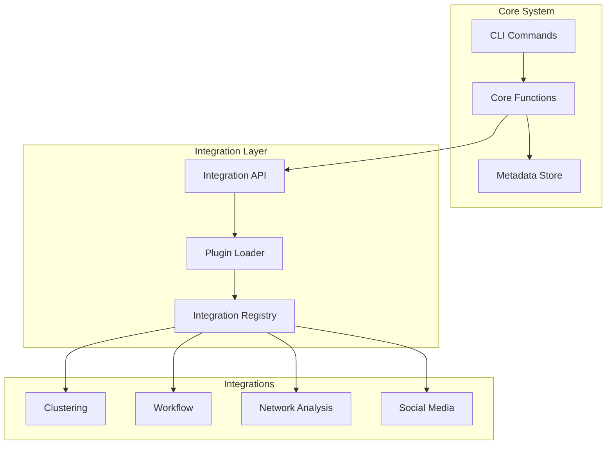

# Integration Architecture Overview

repoindex features a powerful plugin-based integration architecture that allows for extensible functionality through modular components. This document provides an overview of the integration system and available integrations.

## Architecture Philosophy

The integration system follows these core principles:

1. **Modularity**: Each integration is self-contained with minimal dependencies
2. **Composability**: Integrations can work together through standard interfaces
3. **Extensibility**: Easy to add new integrations without modifying core code
4. **Performance**: Lazy loading and optional features for optimal performance
5. **Standards-based**: Uses JSONL for data exchange between components

## Integration Types

### Core Integrations

Built into repoindex and always available:

- **Git Operations**: Repository management, status tracking, synchronization
- **GitHub API**: Issues, pull requests, releases, GitHub Pages
- **GitLab API**: Projects, merge requests, CI/CD pipelines
- **PyPI**: Package detection, version tracking, publishing status
- **Documentation**: MkDocs, Sphinx, Jekyll, Hugo support

### Advanced Integrations

Powerful analysis and automation features:

- **[Repository Clustering](clustering.md)**: Machine learning-based project grouping
- **[Workflow Orchestration](workflow.md)**: YAML-based automation workflows
- **[Network Analysis](network-analysis.md)**: Repository relationship visualization
- **Time Machine**: Historical analysis and trend tracking (coming soon)

### Platform Integrations

External service connections:

- **Social Media**: Twitter, LinkedIn, Mastodon posting
- **CI/CD**: GitHub Actions, GitLab CI, Jenkins
- **Package Registries**: PyPI, npm, Maven Central
- **Documentation Hosting**: GitHub Pages, Read the Docs, GitLab Pages

## Integration Architecture



## Standard Integration Interface

All integrations follow a standard interface for consistency:

```python
class Integration:
    """Base class for all repoindex integrations."""

    def __init__(self, config: dict):
        """Initialize with configuration."""
        self.config = config

    def validate(self) -> bool:
        """Validate integration requirements."""
        pass

    def execute(self, data: Generator) -> Generator:
        """Process data stream and return results."""
        pass

    def get_commands(self) -> List[click.Command]:
        """Return CLI commands for this integration."""
        pass
```

## Data Flow

Integrations work with repoindex' streaming architecture:

1. **Input Stream**: Receive JSONL data from repoindex commands
2. **Processing**: Transform, analyze, or enrich the data
3. **Output Stream**: Return JSONL results for further processing
4. **Composition**: Chain multiple integrations via Unix pipes

Example pipeline:

```bash
# List repos → Filter Python → Cluster → Export
repoindex list | \
  jq 'select(.language == "Python")' | \
  repoindex cluster analyze --stdin | \
  repoindex export markdown --stdin
```

## Configuration

Integrations are configured in `~/.repoindex/config.json`:

```json
{
  "integrations": {
    "clustering": {
      "enabled": true,
      "default_algorithm": "kmeans",
      "default_features": ["tech-stack", "size"]
    },
    "workflow": {
      "enabled": true,
      "workflows_dir": "~/.repoindex/workflows",
      "max_parallel": 4
    },
    "network_analysis": {
      "enabled": true,
      "layout": "force-directed",
      "max_nodes": 500
    }
  }
}
```

## Available Integrations

### Repository Clustering

Advanced machine learning algorithms for grouping similar repositories:

- **Algorithms**: K-means, hierarchical, DBSCAN, spectral clustering
- **Features**: Technology stack, code complexity, size, activity
- **Applications**: Duplicate detection, portfolio organization, tech debt analysis

[Full Documentation →](clustering.md)

### Workflow Orchestration

YAML-based workflow automation with DAG execution:

- **YAML Workflows**: Human-readable workflow definitions
- **DAG Execution**: Dependency management and parallel execution
- **Built-in Actions**: Rich library of pre-built actions
- **Conditional Logic**: If/else conditions and dynamic branching

[Full Documentation →](workflow.md)

### Network Analysis

Visualize and analyze repository relationships:

- **Dependency Graphs**: Visualize project dependencies
- **Collaboration Networks**: Understand team interactions
- **Technology Landscapes**: Map technology usage across projects
- **Interactive Visualizations**: D3.js-powered web visualizations

[Full Documentation →](network-analysis.md)

## Creating Custom Integrations

To create your own integration:

### 1. Create Integration Module

```python
# repoindex/integrations/myintegration.py
from repoindex.integrations.base import Integration
import click

class MyIntegration(Integration):
    """Custom integration for repoindex."""

    def validate(self):
        """Check if requirements are met."""
        # Check for required tools, configs, etc.
        return True

    def execute(self, repos):
        """Process repository data."""
        for repo in repos:
            # Process each repository
            repo['my_field'] = self.analyze(repo)
            yield repo

    def get_commands(self):
        """Define CLI commands."""
        @click.command()
        @click.option('--option', help='My option')
        def mycommand(option):
            """My integration command."""
            # Implementation
            pass

        return [mycommand]
```

### 2. Register Integration

```python
# repoindex/integrations/__init__.py
from .myintegration import MyIntegration

INTEGRATIONS = {
    'myintegration': MyIntegration,
    # ... other integrations
}
```

### 3. Add Configuration

```json
{
  "integrations": {
    "myintegration": {
      "enabled": true,
      "option": "value"
    }
  }
}
```

## Integration Best Practices

### Performance

- **Lazy Loading**: Only load integration when needed
- **Streaming**: Process data incrementally, don't load everything into memory
- **Caching**: Cache expensive computations when appropriate
- **Parallel Processing**: Use multiprocessing for CPU-intensive tasks

### Error Handling

- **Graceful Degradation**: Continue processing even if some items fail
- **Error Reporting**: Output errors as JSONL error objects
- **Validation**: Check requirements before execution
- **Recovery**: Provide recovery mechanisms for failures

### Testing

- **Unit Tests**: Test integration logic in isolation
- **Integration Tests**: Test interaction with repoindex core
- **Mock External Services**: Don't depend on external APIs in tests
- **Performance Tests**: Ensure integration scales well

### Documentation

- **API Documentation**: Document all public methods
- **Usage Examples**: Provide clear, runnable examples
- **Configuration Guide**: Explain all configuration options
- **Troubleshooting**: Common issues and solutions

## Integration Lifecycle

1. **Discovery**: repoindex discovers available integrations at startup
2. **Registration**: Integrations register their commands and capabilities
3. **Configuration**: User configuration is loaded and validated
4. **Execution**: Integrations are invoked as needed by commands
5. **Cleanup**: Resources are properly released after execution

## Future Integrations

Planned integrations for future releases:

- **Container Analysis**: Docker, Kubernetes configuration analysis
- **Security Scanning**: Vulnerability detection and remediation
- **Code Quality**: Static analysis and metrics collection
- **Cloud Providers**: AWS, Azure, GCP integration
- **Issue Tracking**: Jira, Linear, Asana synchronization
- **Time Tracking**: Development time and cost analysis
- **AI Assistants**: Code review and documentation generation

## Getting Help

- **Integration Docs**: See individual integration documentation
- **API Reference**: [Integration API Documentation](../api/integrations.md)
- **Examples**: Check `examples/integrations/` directory
- **Support**: [GitHub Discussions](https://github.com/queelius/repoindex/discussions)